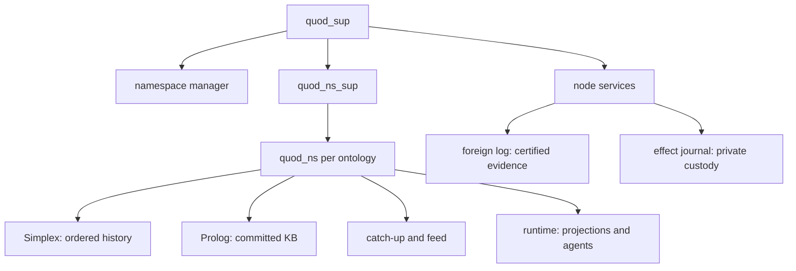

# Quod architecture

Quod hosts durable Prolog ontologies. Each exact ontology identity is a
`{Namespace, GenesisAnchor}` history with its own committee and ordered log.
Prolog owns domain facts, actions, policy and authorization. Erlang/OTP owns
consensus, transport, proof execution and governed contact with the outside
world. No Erlang service is a second domain database.

## State owners

`quod_ns` uses `rest_for_one` order: Simplex, Prolog, catch-up, feed, runtime.
Simplex owns the local ledger, consensus position, signing custody and history
indexes. Prolog applies committed entries and owns its knowledge base and
outcomes. Runtime owns rebuildable subscriptions, reactions, resource
projections and hosted children. A failure of an earlier child restarts its
dependents; a runtime restart does not restart consensus.

Node-wide `quod_foreign_log` retains verified evidence per exact foreign
identity. `quod_effect_journal` retains private direct-effect preparations;
the controlling ontology ledger holds their public descriptors.
`quod_namespace_manager` reconciles committed root and node-actor policy into
desired local child sets. `quod_directory` holds replaceable route hints.

`quod:root` is the configured bootstrap ontology. Its committed
`system_ontology/2` catalogue supplies exact system identities. Actor identity
is `agent_instance_ref(Namespace, GenesisAnchor, Instance)`: a key proves
control of the instance but does not define it. Hosting and key rotation do
not change that reference.

## One request path

A browser client or hosted agent submits signed goal bytes through
`quod_client_goal_ingress`. The target checks the signature, exact identity
and its Prolog `can_invoke/4` policy. A bounded worker proves against a
committed MVCC snapshot and stages changes in private overlays. Foreign
`Namespace::Goal` calls keep the authenticated principal and use the same
proof model. The selected result seals plans; [multiwrite](multiwrite-architecture.md)
describes how they commit.

Consensus orders the record, Prolog applies its diff, and the runtime
installs derived state before live reactions. Rebuilding history restores
facts and projections without replaying old reactions. Pending direct
effects recover through their existing journal. A timed-out submitted write
may have an unknown outcome; callers resolve its original reference instead
of submitting a new operation.

## Boundaries

- [Consensus](consensus-signatures.md) describes committee authority, finality
  and certified history. A route, peer claim or received frame is not proof.
- [Proofs](proofs.md) describes scopes, ACLs, backtracking and sealing.
- [Multiwrite](multiwrite-architecture.md) describes the ordinary, atomic and
  independent write lanes.
- [Lifecycle and routing](lifecycle-and-routing.md) describes root bootstrap,
  ontology creation, host projection and transport hints.
- [Runtime and agents](runtime-and-agents.md) describes installed-state
  notifications, reactions, effects and hosted execution.
- [World](world.md) separates the implemented client substrate from planned
  simulation layers.

Transport uses authenticated pure-Erlang QUIC (`quod_quic`, `quod_conn`,
`quod_link`). Local owners publish scoped installed-state changes through
`quod_reg`/gproc or message a known recipient directly. Workers keep caller
deadlines across routing and waits. The detailed older designs and evidence
remain in [`outdated/`](outdated/).
