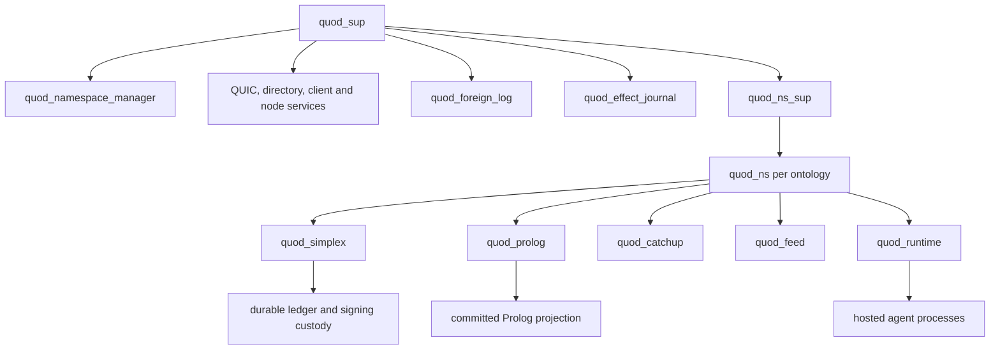

# Quod architecture

This is a map of the architecture implemented in the current source tree. It
identifies the owner of each kind of state and points to the detailed contracts.
The contracts govern their respective protocols; this page is a reading guide,
not a new protocol specification. Product plans and historical build specs are
identified separately below.

## Authority and identity

An ontology is an exact `{Namespace, GenesisAnchor}` history. Its Prolog facts
and rules define domain state, actions, policy, authorization, and consequences.
The anchor binds a namespace to one genesis; re-founding the same name creates
a different identity. Each ontology has its own validator committee and
consensus-ordered material history. The ledger is durable authority; the local
Prolog knowledge base is its ordered application.

An actor is an instance in a containing ontology, addressed as
`agent_instance_ref(Namespace, GenesisAnchor, Instance)`. An active signing key
proves control of that instance but is not its identity. Foreign calls preserve
the authenticated principal and pass through the target ontology's ordinary
`can_invoke/4` policy. Erlang external predicates expose observations and
governed runtime services to proofs; they do not own a second domain model.

`quod:root` is the configured bootstrap ontology. Its committed
`system_ontology/2` catalogue names exact system histories. The local node
actor's committed hosting facts supply the other desired content identities.
`quod_namespace_manager` reconciles those facts into supervised children;
the route directory and endpoint addresses remain disposable hints.

See [ontology actors](ontology-actor-architecture.md),
[consensus signatures](consensus-signatures.md), and
[signed client goals](signed-client-goals-plan.md).

## Process and state ownership

`quod_ns` supervises those five children in `rest_for_one` order. Restarting
Simplex restarts the dependent Prolog, catch-up, feed, and runtime children;
restarting runtime does not restart the history owner. The manager retains
desired child configurations when a dynamic supervisor is replaced.

| Owner | Mutable truth or responsibility |
| --- | --- |
| `quod_simplex` | Local consensus position, signing decisions, durable material log, and retained history indexes for one ontology. |
| `quod_prolog` | Committed knowledge base, proof admission, ordered application, and published outcomes for that ontology. Bounded proof workers use MVCC snapshot handles and staged overlays. |
| `quod_runtime` | Rebuildable subscriptions, reaction discovery, resource projection, and hosted agent lifetimes for that ontology. |
| `quod_foreign_log` | Node wide, identity scoped certified foreign evidence, retained progress, and optional material prefixes. |
| `quod_effect_journal` | Local crash durable custody of private preparations for direct effects; the controlling ontology ledger holds the public descriptor. |
| `quod_namespace_manager` | Desired local content and Brahms child projection from committed root and node actor facts. |
| `quod_directory` | Replaceable, network observed route indexes; routes are never proof authority. |

`quod_dtx_coordinator` is a disposable worker started from an already durable
source role. It observes certified progress and drives target work; it does not
own another decision log. Pure modules such as `quod_atomic`, `quod_dtx`, and
`quod_operation` describe records and transitions without their own process.

See [multiwrite architecture](multiwrite-architecture.md), especially its
“Current implementation status” section, and
[ontology actors](ontology-actor-architecture.md).

## From a signed goal to committed state

1. The client endpoint or a hosted agent submits exact signed goal bytes through
   `quod_client_goal_ingress`. Browser sessions are admitted, and the signature
   and target binding are checked before goal execution. The target ontology
   checks its Prolog ACL.
2. `quod_prolog` runs the goal in a bounded proof worker against a snapshot.
   Local and foreign scopes retain staged changes, read dependencies, and the
   authenticated principal. `action/3` and `goal/1` use Prolog policy;
   `transaction/1` supplies the explicit rollback and atomic intent boundary.
3. The selected proof seals its participating plans. A single writer enters
   that ontology's ordinary transaction path. An ordinary multiwriter uses an
   atomic group with source and target roles. Explicit independent intent uses
   a source claim and separate certified target results. Read dependencies
   are validated against the committed parent; they do not make a read only
   ontology a writer.
4. `quod_simplex` orders the signed record under that ontology's committee.
   `quod_prolog` applies the committed entry and publishes its exact outcome.
   A deadline that expires after submission may yield an unknown outcome
   reference; resolving it observes durable evidence and does not resubmit an
   uncertain write.

Atomic groups use Vote, Resolve, and Complete records. Certified votes decide
commit or abort; a timeout or endpoint refusal does not. Independent targets
can have different certified results. A final independent result requires the
complete target vector. These paths share sealed proof plans and the ordinary
ontology owners rather than transferring a Prolog database between nodes.

See [distributed proof](distributed-proof-plan.md),
[multiwrite architecture](multiwrite-architecture.md), and
[internal Request transactions](fipa-request-transactions.md) for a domain use
of one atomic transition across agents.

## History, evidence, and transport

DispersedSimplex orders one ontology's entries. Committee membership is
derived from committed `peer_admitted` facts. Signed votes, historical
committees, parent ancestry, and finality certificates govern acceptance.
`quod_catchup` serves bounded certified history from a captured view;
`quod_feed` disseminates live material and triggers verified catch-up for gaps.
Historical replay rebuilds state without inventing a live event.

For an exact ontology identity hosted locally, the hosted owner supplies its
history evidence. Other identities use `quod_foreign_log`, which retains
verified progress and fetches only needed evidence or material. A route, peer
height, or received frame is a delivery hint until verification. The foreign
material projection is derived from the owner's certified cache.

`quod_quic`, `quod_conn`, and `quod_link` own authenticated transport and
framed streams. `quod_directory` provides route hints. Local installed-state
changes use `quod_reg`/gproc subscriptions or direct messages to known owners.
Notifications wake affected work; they do not confer consensus or proof
authority. A caller's absolute deadline continues across routing and waits.

See [consensus signatures](consensus-signatures.md),
[transaction signatures](transaction-signatures.md), and
[multiwrite architecture](multiwrite-architecture.md).

## Applied state, projections, and effects

A committed diff first changes durable ontology state (**D**). Runtime owners
then install the derived projection needed by that change (**P**). Live events
and governed effects follow the installed state (**E**). Historical replay
rebuilds state and projections without re-emitting old reactions. The effect
journal separately resumes any committed effect whose custody remains pending.

`trigger_event/1` contributes an event occurrence to a committed diff without
asserting a permanent fact. Editable `react_on/2` patterns match committed
events with Prolog unification. A selected reaction queues an ordinary signed
agent goal; its consequence is durable only if that goal commits. Direct
external effects use a public ledger descriptor and the existing private
effect journal, and become eligible only after ordered apply.

Hosted `quod_agent` processes contain bounded transient work, not a private
knowledge base or durable message queue. The containing ontology owns the
agent's state and host assignment. Recovery and pending work use committed
facts and the same runtime and transaction paths. The bundled internal FIPA
Request rules use ordinary cross-ontology transactions; they do not constitute
a complete external FIPA platform.

See [hosted agents](hosted-agent-runtime.md),
[agent and FIPA plan](agent-fipa-plan.md), and
[internal Request transactions](fipa-request-transactions.md).

## Scope of the documents

| Read for | Documents | Status |
| --- | --- | --- |
| Implemented ownership and protocol detail | [Ontology actors](ontology-actor-architecture.md), [multiwrite architecture](multiwrite-architecture.md), [consensus signatures](consensus-signatures.md), [hosted agents](hosted-agent-runtime.md) | Current contracts with implementation notes; consult source for exact APIs and current deployment state. |
| One implemented FIPA example | [Internal Request transactions](fipa-request-transactions.md) | Internal Request and opt-in continuation; not a full FIPA platform. |
| Product direction | [Client and world](client-world-direction.md), [world consequences](world-consequence-direction.md) | Mix of implemented foundations and planned world/simulation layers; their status sections mark the boundary. |
| Design and build history | [Write lanes](write-lanes-plan.md), [ordering layer Phase 1](ordering-layer-spec.md) | Earlier plans. The Phase 1 Raft ordering spec explicitly says it is superseded by DispersedSimplex. |
| Engineering rules | [Working agreement](../../AGENTS.md) | Governs architecture changes, review, and verification. |

The current source tree is the final check for implementation claims. In
particular, a plan's old “today” wording or completion checklist does not by
itself establish current runtime behavior.
