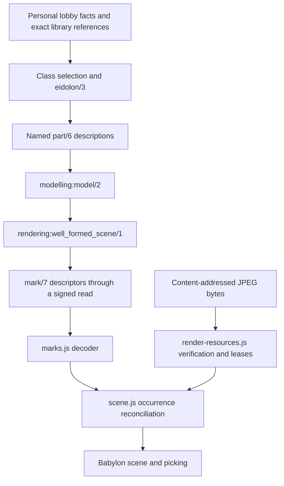

# Eidolon mesh support

This is a source-based assessment and extension proposal. The implementation
currently renders primitives and JPEG textures; imported models are proposed
here. The governing direction is already present in
[client-world-direction.md](client-world-direction.md#L258),
which calls for content-addressed glTF/GLB assets inside ordinary Eidolon recipes.
The ownership and execution constraints remain those of
[multiwrite-architecture.md](multiwrite-architecture.md).

The recommended approach is to accept common authoring formats at import time
and publish a validated GLB for rendering. An Eidolon remains a Prolog recipe:
it can combine an imported model with primitive parts, labels, other recipes
and interaction bindings. A mesh file supplies geometry and appearance to that
recipe; it does not replace the recipe or the depicted domain entity.

## The implemented path



| Owner | What it does now |
| --- | --- |
| [lobby_instance.pl](../../priv/ontologies/lobby_instance.pl#L9) | Reads the personal world's instances, sky and placements; invokes pinned recipe and modelling ontologies through `Namespace::(current_ontology_identity(Namespace, Anchor), Goal)`. |
| [quod_lobby.pl](../../priv/ontologies/quod_lobby.pl#L63) | Resolves class associations with explicit ambiguity handling, evaluates `eidolon/3`, composes device parts and material/environment recipes. |
| [quod_modelling.pl](../../priv/ontologies/quod_modelling.pl#L14) | Pure construction: evaluates dimension arithmetic, produces marks, scopes part IDs with `place_model/5`, and derives local alignment with `align/6`. It asserts no generated scene facts. |
| [quod_rendering.pl](../../priv/ontologies/quod_rendering.pl#L76) | Defines seven geometry kinds and a transform group, dimensions, surface/texture semantics, descriptor bounds, distinct occurrence IDs and parent ordering. |
| [world.js](../../client/src/world.js#L22) and [marks.js](../../client/src/marks.js#L31) | Obtain ordinary signed projections and decode supported descriptors. Unknown geometry or asset types fail visibly. |
| [scene.js](../../client/src/scene.js#L25) | Maps primitive kinds to Babylon geometry and surfaces to PBR materials; reconciles stable IDs and retains unchanged resources. |
| [render-resources.js](../../client/src/render-resources.js#L5) | Shares fetched bytes by digest and textures by binding, checks SHA-256 before decode, cancels the last consumer's fetch and retires stale completions. |
| [world-scene.js](../../client/src/world-scene.js#L38) | Owns the viewing scene, camera, lighting, picking and XR. Picking walks ancestors to find an anchored depicted entity. |

The present wire description is:

```prolog
mark(Id, Kind, Size, Transform, Surface, Label, Depicts).
```

`Size` is currently an ordered list of positive integer dimensions. Placement
uses integer millimetres and whole degrees, right-handed coordinates and Y up.
The console's front is -Z. Rotations apply X, then Y, then Z. Surfaces carry
colour, metallic/roughness/emission factors in permille and typed texture slots.
The client converts these numbers at the rendering boundary.

Keep four identities separate: the entity's namespace/anchor/term, the recipe's
namespace/anchor/name, the asset's content digest, and the view's occurrence ID.
An ontology anchor identifies a history; it does not freeze the recipe's code
against later edits. Reproducible projections also need the relevant committed
snapshots, as the existing design specifies.

The UI currently obtains scene snapshots when its view inputs or refresh
revision change. The scene reconciler reuses resources across those snapshots;
this is not yet the full future incremental world-stream service described in
the direction document. Mesh support need not introduce that service.

There are two narrower integration boundaries to preserve. The lobby's current
device recipe caller evaluates locally selected `eidolon(Recipe, device(Entity),
Parts)` recipes; it is not a general foreign model-library dispatcher. Material
and environment recipes already demonstrate explicit anchored library calls.
The per-entity Eidolon selector in
[World.tsx](../../ui/src/World.tsx#L179) currently opens a Prolog
workspace, whereas the lobby's playing/edition mode selects its geometry.
Adding a mesh kind does not automatically make that workspace selector a model
picker. Start through the existing lobby projection; general per-entity visual
selection would extend the world's selection policy and typed projection.

The older implementation summary in
[client-world-direction.md](client-world-direction.md#L1843)
still groups textures with unimplemented features. The current source and tests
implement JPEG textures; the imported-model gap remains. This assessment uses
the source for that status distinction.

## What Erlang does here

There is no rendering-specific Erlang predicate module or native mesh renderer
in this path. Prolog describes the scene; browser JavaScript creates GPU resources.

The Erlang support is the existing proof and runtime infrastructure:

- [quod_ask.erl](../../src/predicates/quod_ask.erl) implements scoped
  cross-ontology calls and their authorization/proof boundaries.
- [quod_runtime_predicates.erl](../../src/predicates/quod_runtime_predicates.erl#L24)
  supplies proof-bound `current_ontology_identity/2` and the common reaction bridge.
- [quod_agent_predicates.erl](../../src/predicates/quod_agent_predicates.erl#L21)
  exposes the authenticated principal used by relevant ontology policies.
- [quod_common_primitives.erl](../../src/predicates/quod_common_primitives.erl#L21)
  provides pure helpers such as `binary_codes/2`, used for paths and digest syntax.
  This helper is not a live external observation.
- [quod_predicates.erl](../../src/quod_predicates.erl#L27) governs
  external predicate classes and dependencies: proof-bound values, committed
  snapshot reads and live observations have different sealing implications.

The texture files are presently public, packaged application assets. Both
[quod_client.erl](../../src/quod_client.erl#L92) and
[quod_explorer.erl](../../src/quod_explorer.erl#L44) serve them through
Cowboy's static asset route. The browser fetches a digest-derived texture path.
Provenance URLs in recipe libraries are not arbitrary runtime download commands.
This is not an upload service, durable general blob store or private-asset ACL.

## Formats and conversion

Use one runtime model format initially: a defined subset of glTF 2.0 packaged
as GLB. Babylon documents glTF/GLB, OBJ and STL loaders, but does not list FBX as
a standard runtime loader. Its own editor sends FBX to a conversion service.
This supports an import boundary rather than an FBX decoder in each Quod client.
See [Babylon loader documentation](https://github.com/BabylonJS/Documentation/blob/master/content/features/featuresDeepDive/importers/loadingFileTypes.md)
and [the editor's FBX import description](https://editor.babylonjs.com/documentation/basics/composing-scene).

The following is a proposed support sequence, not a claim that Quod imports
these formats today:

| Input | Published rendering asset | Qualification needed |
| --- | --- | --- |
| GLB | Validated GLB; retain bytes when already compliant | Accepted features, embedded dependencies, units and resource costs. |
| glTF plus buffers/images | Packaged GLB | Resolve the supplied dependency bundle and report missing files. |
| FBX plus textures | Converted GLB | Source units, axes, pivots, material conversion; rigs and clips when motion support is added. |
| OBJ/MTL plus textures | Converted GLB | Material and texture mapping, normals, explicit source units. |
| STL and polygon PLY | Converted GLB | Geometry, units and an explicit appearance where absent. Point clouds need a separate declared rendering capability. |
| DAE/Collada | Converted GLB through a qualified importer | Version, hierarchy and material fidelity. |
| USD/USDZ and native authoring files | Later qualified import profiles producing GLB | Select/bake a renderable representation and report unsupported authoring features. |

Evaluate a pinned Blender import/export toolchain first for FBX. Its glTF
exporter documents mesh, PBR, skinning and animation support, alongside material
conversion limitations. A representative fixture corpus must establish actual
fidelity before advertising support. [Blender glTF documentation](https://docs.blender.org/manual/en/5.3/addons/scene_gltf2.html)

Assimp is an option for additional explicit import profiles: its format list
includes FBX, OBJ, STL, PLY, DAE and USD, and identifies glTF export as partial.
Its current documentation deprecates native Blender-file support. Do not infer
lossless conversion from an extension appearing in a list, or silently retry a
failed import through another converter. [Assimp format support](https://github.com/assimp/assimp/blob/master/doc/Fileformats.md)

Keep conversion outside consensus. Record the source digest, selected importer
and version, options, output digest, validation profile, diagnostics and licence
provenance. A converter upgrade can produce different bytes; publish the new
digest explicitly. Validators replay accepted references and metadata, not the
conversion program. Start with local/offline conversion; a hosted import worker
is only needed when the product supports online uploads.

## Extend the current descriptor model

Retain `part/6`, `model/2`, `place_model/5` and `mark/7`. Generalize the third
mark argument from primitive dimensions to kind-specific geometry data. One
shared validator and decoder handle primitive dimensions and a typed mesh-asset
payload. The field-name and arithmetic helpers currently assume every geometry
is a list of dimensions; both must change at that shared seam.

An illustrative recipe follows. `mesh_resource/3`, `mesh_asset/4`, `aabb/6`
and `asset_surfaces` below are proposed vocabulary, not callable support today:

```prolog
class_eidolon(chair, playing, solid, recipe(Ns, Anchor, chair_mesh)) :-
    current_ontology_identity(Ns, Anchor).

eidolon(chair_mesh, subject(ontology_ref(Ns, Anchor), Entity),
    [part(<<"body">>,
          mesh_asset(Asset, <<"gltf2-static-v1">>, scale(1000), Bounds),
          transform(0, 0, 0, 0, 0, 0),
          asset_surfaces, unlabelled, depicts(Ns, Anchor, Entity))]) :-
    mesh_resource(chair, Asset, Bounds).
```

`Asset` is `asset(Sha256Hex, <<"model/gltf-binary">>)`. `Bounds` is a bounded
integer-mm `aabb(MinX, MinY, MinZ, MaxX, MaxY, MaxZ)` derived from that exact
asset's published import metadata. Uniform scale uses permille. Compilation
would produce a `<<"mesh">>` mark carrying this typed payload and the same
placement, subject and occurrence semantics as existing marks. These term
signatures are a concrete design sketch; installing the schema remains an
ordinary coordinated vocabulary/client change.

The example's subject-bearing recipe input illustrates a general model-library
consumer. A first lobby fixture can keep its existing `device(Entity)` recipe
input and let `place_model/5` put the anchored subject on the instance group,
as it does today. Neither option requires a new Erlang rendering call.

Only bounded metadata and references enter ontology facts. Floating-point
vertex data, internal transforms and material data remain inside the immutable
asset; this does not loosen the integer contract for Prolog-authored placement.

A mesh asset represents an imported model subtree, potentially containing many
meshes and material slots. It must not mean just the first mesh in a file.
For the first profile, require one explicitly selected scene in the published
asset. All its roots belong beneath the occurrence root. Importing a different
scene selection produces an explicit asset variant.

Bounds must describe the asset's local origin, not assume it is centred like a
box primitive. Publish conservatively rounded bounds and any pivot/front
normalization with the asset. Generalize alignment to those anchors while
preserving the existing whole-mm exactness rule. Labels also need these bounds;
the present helper only checks primitive height/diameter. Metadata is a declared
layout input, not authority for collision or gameplay physics.

glTF uses metres, right-handed Y-up coordinates and +Z forward; the console
convention uses -Z as its front. Preserve asset-internal transforms and apply
any authored front/pivot correction exactly once. Do not divide already-metre
vertices by 1000 just because occurrence translations use millimetres.
[glTF coordinates and units](https://registry.khronos.org/glTF/specs/2.0/glTF-2.0.html#coordinate-system-and-units)

`asset_surfaces` must have defined portable semantics: use the asset's accepted
glTF material descriptions. The existing `surface/5` cannot represent every
imported material, including separate emissive colour and opacity settings.
Do not overwrite the model's materials with a single primitive material.
Start by preserving approved embedded surfaces. Later overrides can use bounded
material-slot identifiers and the shared optical vocabulary. Slot mappings are
bound to the asset digest; source display names are not stable domain identities.

## Asset profile, resource ownership and policy

Define the initial static profile explicitly: triangle meshes and transform
hierarchies, the agreed core PBR surface features, embedded PNG/JPEG images,
and no animations, skins, morphs, cameras or lights. Unsupported input features
produce diagnostics; dropping them requires an explicit import choice. Extension
support is an allowlist with declared capabilities, not whatever the current
Babylon loader happens to recognize.

GLB can still reference external resources. The first Quod profile should
require a self-contained asset and reject unresolved/external URIs before
instantiation. Later multi-file assets need a digest-checked dependency
manifest and governed resolution. [GLB specification](https://registry.khronos.org/glTF/specs/2.0/glTF-2.0.html#glb-file-format-specification)
Use the [Khronos validator](https://github.com/KhronosGroup/glTF-Validator) for
format validation, plus Quod's profile and resource checks; format validity
alone does not establish permission or acceptable cost.

Extend the existing scene-owned resource service, replacing its JPEG-specific
fetch assumption with shared typed asset acquisition. Keep texture bindings as
one consumer of that common verified-byte path. Add a decoded-model lease
keyed by digest and relevant import/profile options, retained while any live
occurrence consumes it. Do not introduce a second mesh asset manager.

The repository pins Babylon core and GUI to 9.18.1 in
[package.json](../../client/package.json). It does not install the
model loader package. Add a matching, pinned glTF loader. The installed core's
[scene loader types](../../client/node_modules/@babylonjs/core/Loading/sceneLoader.d.ts#L284)
accept byte views and expose `LoadAssetContainerAsync`; its
[asset container types](../../client/node_modules/@babylonjs/core/assetContainer.d.ts#L214)
support instantiation/cloning. Load verified bytes into a retained container
and realize occurrences under reconciler-owned transform roots. Decoder code
and any future compression helpers belong to the packaged client release.

Each occurrence owns its instantiated subtree; the resource service owns the
shared decoded template. Preserve these lifetime rules:

- An unchanged projection or transform-only edit performs no fetch, hash,
  parse, mesh reconstruction or GPU upload for that asset.
- Uniform occurrence scale updates the root and derived bounds/labels, rather
  than becoming part of the decoded template's identity.
- Two occurrences share immutable resources and keep distinct transforms and
  selection identities. Material edits must not mutate a shared template.
- A resource replacement acquires the new lease before releasing the old one.
  Async completion checks the current occurrence and resource revision; removal
  or identity changes invalidate it. Decode failures remain visible.
- Dispose the imported subtree and its instance-specific resources, then
  release its template lease. The current non-recursive occurrence disposal
  protects independently reconciled child marks and must continue to do so.
  Late decode results must be disposed even if the decoder cannot be cancelled.
- Picking a nested imported mesh resolves through the enclosing occurrence's
  anchored `depicts`. File names, node names and imported metadata cannot create
  subjects, action menus or authority. Separately selectable subparts require
  an explicit recipe mapping to authorized domain subjects.

Asset budgets belong in Prolog policy. Describe actual resources: transfer
bytes, decoded image pixels, geometry buffers/vertices, primitives/draws,
nodes and materials, then joints/morphs/clips as those features are added.
Runtime code enforces the authorized allowance and reports the exceeded resource.
The present 512-mark scene bound does not bound a single imported model's cost.
Bound downloads while streaming and check actual asset structure; untrusted
metadata must not understate allocations. Device capacity may further restrict
what a client can realize, without granting domain permission.

For the first public packaged model, the existing static route is sufficient
and **no new Erlang predicate is needed**. For user uploads/private assets,
storage and authorized byte delivery are concrete missing capabilities. A
digest proves content identity, not read permission. Reuse ontology ACLs and
signed ingress to authorize publication and access; raw static delivery cannot
enforce private-asset policy.

Online import requests, if added, belong to ordinary Prolog actions and durable
ontology job state. Governed Erlang bridges expose bounded storage/conversion
services with correct dependency classes and declared module manifests. Long
work runs asynchronously outside the state owner. Never call an FBX importer,
download a file or observe local readiness from `eidolon/3` or a deterministic
authorization re-proof.

Admit an import report under explicit publisher/importer authority, bound to
the source/output digests and profile. A node's current file availability is a
live observation, not a deterministic publication prerequisite. Replay uses
the accepted durable report; clients still verify bytes and enforce actual
resource costs before use.

Publication first obtains the immutable artifact and verified report, then
commits the accepted metadata, recipe/appearance changes and any coupled domain
consequences through the existing atomic transaction path. A byte upload is
not itself an ontology commit; failure leaves an unreferenced artifact rather
than a half-published appearance. Conversion is preparation, not a reason to
split one domain transition into multiple dependent commits.

If hosted work is needed, extend existing agent ownership, queues, reactions
and recovery. Match completion through existing event-pattern unification;
notify only dependent work with the owning incarnation and original deadline.
Restore pending state through the existing recovery lifecycle, without replaying
historical completion effects. Ordinary redraws never trigger import or history
rebuilds. This preserves the action/savepoint and D/P/E contracts in
[common_predicates.pl](../../priv/ontologies/common_predicates.pl#L119),
[quod_action_predicates.erl](../../src/predicates/quod_action_predicates.erl#L5)
and [event-reaction-refinement-plan.md](event-reaction-refinement-plan.md).

## Implementation sequence and acceptance

1. **One public static model through the whole path.** Extend the shared
   rendering/modelling schema, mark decoder, reconciler and resource owner;
   add the glTF loader and a licensed, asymmetric GLB fixture. Author a normal
   class-selected recipe and place it twice. This establishes the core asset
   concept without requiring an upload service.
2. **Qualified import and publication.** Add the pinned conversion/validation
   toolchain and provenance manifest. Cover GLB/glTF, FBX, OBJ, STL and polygon
   PLY with real source fixtures. Add other formats through explicit import
   profiles. Online authoring adds storage/access and ordinary publication
   actions when that consumer exists.
3. **Motion and editable parts.** Extend the same descriptors with bounded
   rig/clip/morph references, explicit playback state and attachment points.
   Retain per-occurrence skeleton/playback state. Do not let loader defaults
   auto-start animations. Bones and cosmetic animation do not establish
   authoritative physical attachment, collision or action completion.

For step 1, the production core is the two existing rendering/modelling
ontologies and the three existing decoder/reconciler/resource modules, plus
the dependency declaration and an authored recipe. Replace primitive-only
assumptions in those owners. Keep one pipeline for primitives and imported
models; no new per-model Erlang process or domain knowledge store is justified.
Production line growth should represent the new geometry/resource capability,
with its actual delta reported during implementation.

Acceptance should exercise production seams, extending the existing tests:

- Prolog validates the new descriptor and refuses malformed digests, profiles,
  scales, bounds and surfaces. Exact recipe/subject identity, ambiguity and
  read/edit policy remain enforced through real cross-ontology reads.
- A real GLB's full hierarchy and materials render, with an asymmetric model,
  off-centre pivot and rotated parent exposing unit/front/alignment mistakes.
  Nested picking reaches the right entity for each of two instances.
- Count fetches, hash/decode calls and resource creation across unchanged and
  transform-only refreshes: no repeated work. A real digest update installs the
  replacement and releases the retired resources without disturbing another user.
- Reject corrupted bytes, unsupported features, external dependencies and
  exceeded resource allowances before the relevant resource becomes usable.
  Cancellation, failed decode, deletion and scene/identity changes cannot allow
  late completion to restore an old object or leak a decoded model.
- Test the actual browser loader and image/GPU path in addition to the existing
  NullEngine tests. Verify public asset delivery and private access separately
  if private storage is introduced. Test conversion fidelity with real FBX
  sources; a successful file parse alone is insufficient.
- Accepted appearance changes and their coupled consequences remain atomic;
  recovery restores accepted descriptions without repeating imports or effects.

Deploy the client and ontology vocabulary through the existing coordinated
release and authorized ontology-edit/succession paths. Update affected pinned
dependencies and existing consumers explicitly. Editing these source files
does not change already-founded ontologies. No data wipe or parallel legacy
renderer is part of this proposal.
