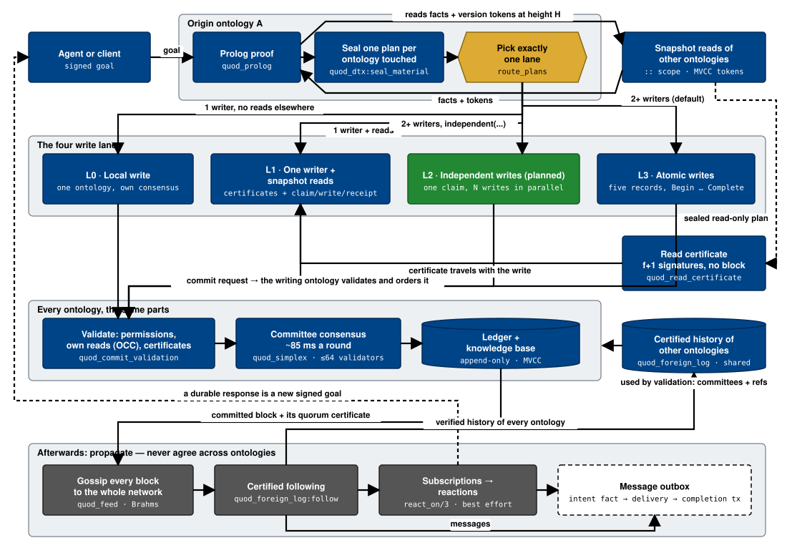
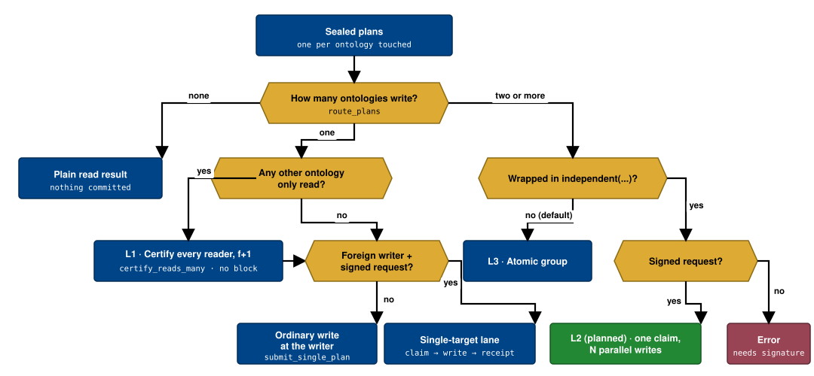
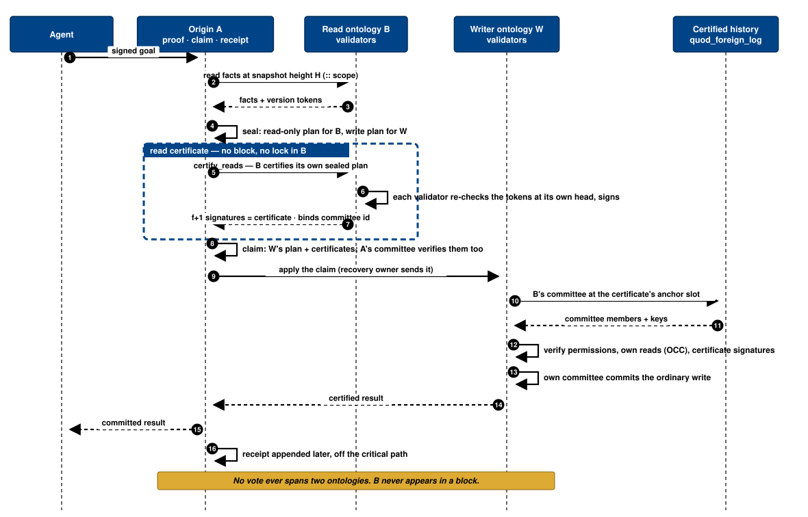
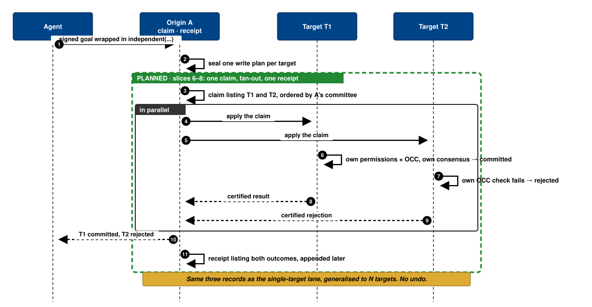
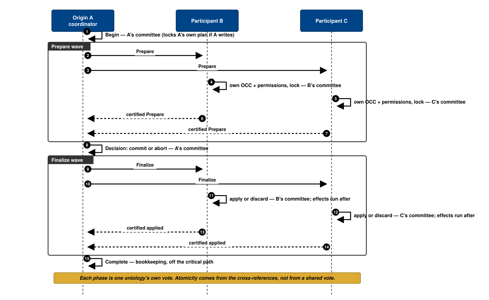
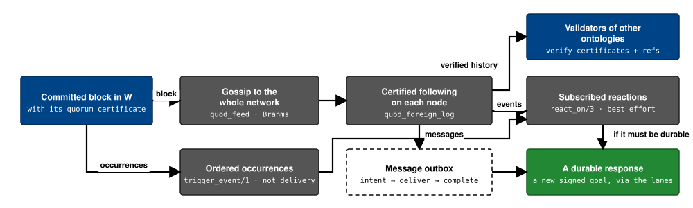

# Write lanes — cross-ontology writes without cross-ontology consensus

Status: **approved architecture plan** (Yan, 2026-08-29). Author: Claude
(review/plan role). Implementation: GPT, slice by slice, each slice reviewed
before the next. Slice 1, the read-certificate primitive, is implemented and
reviewed with no blocker. Slice 2, the signed carrier and shared validation
path, is implemented and reviewed with no blocker. Slice 3, the sealed-scope
certificate command, is implemented and reviewed with no blocker. Slice 4,
the lane chooser and certificate routing, is implemented and reviewed with no
blocker; slices 5–8 are not built.

Diagrams (static SVG, exists-today in dark blue, new in green):
`figures/write-lanes/` — overview, lane chooser, one sequence per lane,
propagation layer.

## 1. Context

Today a goal that writes into several ontologies goes through a five-step
all-or-nothing protocol (Begin → Prepare → Decision → Finalize → Complete).
Each step is a separate consensus round in one ontology. That is why a
four-ontology write costs ~0.7 s warm at best while a single-ontology write
costs ~0.13–0.4 s, and why the code around it keeps growing.

The design rule this plan implements: **consensus happens only inside an
ontology, never between ontologies.** Between ontologies there are only
three things: a signed request, a certified snapshot, and a certified
receipt. The research surveyed for this plan (FastPay/Sui, Saga, TCC,
Chainspace; §9) agrees: good systems keep a separate lane per need and keep
the expensive all-or-nothing lane almost empty.

This plan decides which lane each kind of write takes, so that most writes
never touch the expensive one.

## 2. Findings from the codebase

### F1. How a goal was routed before Slice 4

Before Slice 4, after a proof every ontology it touched was sealed. An
ontology counted as "material" — and got a full Prepare/Finalize slot in the
group — if its plan had **any** of: a write, **a read**, or an effect
(`quod_dtx:material_participant/1`, `quod_dtx.erl:481-496`).

The cheap single-target lane (claim in A → ordinary write in B → receipt in
A; roles `remote_claim` / `remote_application` / `remote_complete`) was taken
only when **exactly one** ontology is material, it is not the source, the
request is client-signed, and no third ontology was touched.

The consequences were:
- A goal that *reads* B and *writes* D is a 2-participant group: B gets
  Prepare and Finalize rounds although nothing is written there.
- A goal where the source A writes anything and one remote B writes is a
  group, not a singleton.
- Only the group lane exists for two or more material ontologies.

### F2. Reads never lock (`quod_ask.erl`, `quod_erlog_db_local_prove.erl:875-887`)

A `::` read captures a per-predicate version token (first-read-wins) from the
target's MVCC snapshot. The token is re-checked at commit
(`quod_diff:validate/2`) — by B's own validators in the group lane, by the
target's validators in the singleton lane. Read consistency is therefore
already optimistic (OCC), not lock-based; the Prepare slot of a read-only
participant exists only to hold that OCC check open until Finalize.

### F3. What real goals look like (tests and docs)

| Shape | Examples | Today |
|---|---|---|
| Write in ONE ontology, but the proof also **read** one or two others (authorization read, prerequisite `Ns::goal(State)`, callback read) | `t_failed_foreign_branch_retains_state`, `t_reentrant_scope_reuse`, `foreign_prerequisite_uses_normal_scope_boundary`, most `::` goals | full group (2–3 participants) |
| Write in ONE remote ontology, nothing else touched, signed | loadtest one-hop, `remote_signed_gateway_*` singles | single-target lane (fast) |
| Writes in TWO+ ontologies that are **independent facts** (a mark here, a mark there) | `dtx_write_chain` (B+C), `remote_signed_group_uses_exact_agent_request` (A+B+C), the A→B→C→D benchmark | full group |
| Writes in TWO+ ontologies that are a **transfer of something conserved** (take here, give there — the "sword move") | `content-layer-design.md:639`, inventory/cohort in `world-consequence-direction.md:673,1041` | full group — and the docs require this to stay atomic |

Two written decisions to respect:
- `content-layer-design.md:639-644`: conserved-resource moves are **coupled by
  default**; compensation has no general construction for effect-bearing
  writes.
- `world-consequence-direction.md:673-682`: "A DTX per sword swing is not
  affordable. Design the common path to stay inside one namespace, and make
  cross-ontology consequence a deliberate, rare, low-rate case."

The product already wants atomicity only for transfers, and rarely. The code
today makes *everything* that touches two ontologies atomic — including plain
reads. That is the gap.

### F4. "Propagate later" already exists, and is explicitly non-atomic
- Subscriptions + `react_on/3`: best-effort reactions over certified follow;
  a durable response is a new signed goal.
- `trigger_event/1`: an ordered occurrence, not a delivery.
- Durable outbox (spec in `agent-fipa-plan.md:639-704`): intent fact →
  separate completion tx → receiver dedup by MessageId. This is **the same
  shape as the single-target lane** (claim → write → receipt).

### F5. What can and cannot be undone

- A write is a list of `assert` / `retract` / `event` on facts
  (`quod_diff.erl`). Assert and retract are reversible on the knowledge base;
  the ledger is append-only, so an undo *adds* a record, never erases one.
- `event` and reactions are published occurrences — not reversible.
- "Effects" are today exactly one family: creating or joining an ontology
  (`quod_effect.erl:22-25`). Max one per plan; a plan with an effect has no
  fact writes. Effects run only after the participant's Finalize(commit) and
  are never rolled back (`dtx-durable-effects-plan.md:777`).
- OCC is strictly per ontology: each ontology checks only its own reads at its
  own commit; read tokens carry no namespace (`quod_ledger.hrl:35-47`).
- The single-target lane is already non-atomic between A and B by design: A's
  claim and receipt are ledger metadata, never facts, so nothing in A needs
  undoing if B rejects.

## 3. Decisions taken (Yan, 2026-08-29)

1. **Multi-ontology writes are atomic by default; a goal opts out** to the
   fast parallel lane by saying so explicitly.
2. **Read-only ontologies may skip consensus**: their validators co-sign a
   snapshot certificate instead of holding Prepare/Finalize rounds.

## 4. The plan: one lane per need

| Lane | When | How | Cost |
|---|---|---|---|
| **L0 — local** | writes in one ontology, reads nowhere else | as today | ~0.4 s |
| **L1 — one writer + snapshot reads** | writes in ONE ontology, reads in others | read ontologies issue a **read certificate** (validators co-sign the read plan at their height — no block); the write goes through the existing single-target lane (claim → write → receipt), or L0 if the writer is local | ≈ one-hop (0.13–0.22 s p99 measured) + one parallel signature round-trip |
| **L2 — independent writes** | writes in TWO+ ontologies, goal says `independent(...)` | one claim in the source listing all targets → N ordinary writes in parallel → one receipt with per-target outcomes; a rejected target stays rejected, the others stay committed; no undo | ≈ one-hop regardless of N |
| **L3 — atomic writes** | writes in TWO+ ontologies, default (transfers) | existing Begin/Prepare/Decision/Finalize/Complete, unchanged; rare by design; optimised later | ~0.7 s warm today → ~0.5 s after optimisation |

What changes for a goal author: nothing for L0/L1 (automatic). For
multi-ontology writes the default stays safe (L3); wrapping the writes in
`independent(...)` picks L2. `transaction(...)` keeps its current meaning.

What leaves the hot path: the Prepare/Finalize rounds for every ontology
that was only read; the whole group protocol for independent writes; the
one-DTX-control-per-block queue on the source for both (claims are ordinary
source transactions and batch into blocks like any other).

What stays strictly the same: each ontology validates its own reads, rules
and permissions at its own commit; the origin never writes around a target's
rules; effects still run only after the owning ontology's commit.

### 4.1 Which lane does a goal take?

Writers = ontologies with a write or an effect. Readers = ontologies with
only reads. Decided once, after sealing.

| Writers | Readers | Signed | `independent` | Lane |
|---|---|---|---|---|
| none | any | — | — | read result (unchanged) |
| origin only | none | — | — | L0 (unchanged) |
| origin only | some | — | — | L1-local: certificates → `submit_single_plan` |
| one remote | none | yes | — | claim lane (unchanged) |
| one remote | some | yes | — | L1-remote: certificates → `submit_remote_claim` |
| one remote | some | no | — | L1 via `submit_single_plan` at the writer |
| ≥2 | any | any | no | L3 group (unchanged) |
| ≥2 | any | yes | yes | L2 fan-out claim |
| ≥2 | any | no | yes | error `independent_requires_signed_request` |

Slice 4 replaces `quod_dtx:material_participant/1` with `writes/1` and
`reads_only/1`; the `SignedForeign` computation and the four-case match in
`submit_sealed_plans` are deleted.

### 4.2 L1 — the read certificate (the biggest win)

**What it is.** When a proof reads ontology B and writes elsewhere, B's
validators sign a short statement: "this read plan (digest) is valid against
my committed state at height H". No block is written in B and nothing is
locked. The writer's validators check the signatures and accept the write as
valid at that snapshot. B may change afterwards — that is the accepted
meaning of a snapshot read. The writing ontology still runs its own rules,
permissions and OCC at its own commit.

**Reuse, don't invent** (verified in source):
- The read already ends in a sealed read-only plan in B's scope session
  (`quod_scope_session.erl:931-951`, `quod_dtx:seal_material/10`). The sealed
  state already accepts a follow-up command (`scope_attest`,
  `quod_prolog.erl:2386`) — the certificate request is a sibling command in
  the same state.
- A signer at B checks the plan exactly as a Prepare would
  (`quod_diff:validate/2` at its own head, `quod_commit_validation.erl:569-581`)
  and signs the digest. Same check, no new semantics.
- Collection reuses the applied-certificate skeleton in
  `quod_dtx_current_view` (`probe_sources/4`, `collect_quorum/5`,
  `sign_applied_vote/8`, `verify_applied_certificate/3`) as a sibling family:
  `certify_reads/3`, `sign_read_vote`, `verify_read_certificate`.
- **Signatures needed: f+1** (`threshold/1` = `N − quorum(N) + 1`, verified
  with `quod_quorum:sanitize_at_least`). One honest validator suffices
  because the statement is about committed state that anyone can re-check;
  2f+1 is only for ordering decisions.
- Transport: one new endpoint request `{read_attest, RequestId, PlanBlob}` in
  `quod_dtx_endpoint`, served next to the existing `{applied, …}` clause in
  `quod_simplex`.

**Where the certificate travels.** A new `#transaction` field
`foreign_reads = []` (`include/quod_ledger.hrl`), signed by the author but
excluded from the transaction's identity (same rule as `evidence`,
`quod_transaction:semantic_id/2`). `read_check` stays local-only and
unchanged — the certificate references the plan digest, never decoded facts,
so the atom boundary holds.
- Remote writer: the claim carries `foreign_reads`; `remote_application/2`
  copies them into the target write; `quod_commit_validation` gains one
  `validate_foreign_reads/2` used by both roles.
- Local writer: threaded through `submit_single_plan → submit_plan_encoded →
  from_plan`.
- In the signed remote-claim lane, the origin is treated like every other
  read-only dependency: its reads are certified and carried in
  `foreign_reads`; the claim has an empty `read_check`. The target validates
  that certificate through the same `validate_foreign_reads/2` path as every
  other reader, without validator-to-validator fan-out. The claim records the
  signed operation; it does not authorize the target action. The target's
  existing sealed `can_invoke/4` transcript remains the only authorization for
  the target write.

**Binding to B's committee.** The certificate binds
`{B identity, ProofId, PlanDigest, AnchorRef, CommitteeId}` where AnchorRef is
a certified ref to B's last non-noop slot ≤ H. The shared certified-history
projection retains one in-memory row per committee era, so exact-reference
verification selects the post-anchor committee and id independently of the
verifier's current cache head. The durable checkpoint remains compact; the
existing restart replay rebuilds the era rows. Deterministic, no clocks and no
second verifier or cache.

### 4.3 L2 — independent writes (`independent(...)`)

Generalise the single-target lane to N targets. The manifest already takes N
rows (`quod_dtx:new_manifest`); what assumes one target is the claim role
(`remote_claim` stores one predicted target tx id,
`quod_transaction.erl:132-138`), `remote_application/2`, the outcome row (one
`outcome_ref`), and the operation monitor's two-state drive
(`quod_dtx_coordinator.erl:363-395`).
- Claim role becomes `{remote_claim, Manifest, [Bundle], [{Target, PredictedTxId}]}`.
- The monitor sends the same `apply_claim` to every target in parallel
  (spawn-and-collect pattern from `collect_many_results`) and waits per
  target.
- Receipt becomes `{remote_complete, OperationRef, RequestDigest,
  [{TargetRef, committed | {rejected, R}}]}`; a rejected target still yields
  a certified ref. Nothing is undone.
- Effects allowed: one per target, owned by that target.
- `independent/1` is a proof-level flag in `quod_proof_context` (not the
  absence of `transaction/1` — that would flip the safe default). Error if
  nested inside `transaction/1`. Requires a signed request (the lane needs a
  durable operation ref).

### 4.4 L3 — atomic writes: unchanged

Two or more writers without `independent` → the existing group protocol.
Keep it, expect it to be rare, optimise it later (waves, batching) once L1
and L2 show how much traffic is left in it.

### 4.5 Afterwards: propagation without agreement

Once a block is committed it spreads by gossip, is verified as certified
history on other nodes, and drives local reactions. None of this asks any
ontology to agree with another; a reaction that needs to be durable becomes
a new signed goal and goes through the lanes above.

## 5. What gets deleted (no shims)
- `material_participant/1` and the `SignedForeign` case in `submit_sealed_plans`.
- Single-bundle shapes in `remote_claim` / `remote_application` /
  `remote_complete` and `remote_claim_target/1` (L2 slices).
- Version bumps, no dual decoders: `quod_transaction ?VERSION`, endpoint
  request vocabulary, scope-wire command set (fresh genesis, project policy).
- Doc passages that state the old rule: `distributed-proof-plan.md:1003`
  ("independent appends are forbidden" → "unless declared"),
  `inter-ontology.md:178-184` and `:569-575` (read-dependent → certificate;
  only ≥2 writers group).

## 6. Slices, in value order (each independently green)
1. **Read-certificate primitive** — `quod_read_certificate` (statement,
   sign, f+1 verify), `read_attest` endpoint request/response, simplex serve
   clause, `quod_dtx_current_view:certify_reads/3`. Tests: threshold reached /
   not reached / stale-token refusal. **Implemented; review closed.** An
   observer returns typed `read_certificate_unavailable`; L3 remains unchanged.
   An f+1 quorum of stale-token refusals remains the typed
   `conflict_retry`; one refusal cannot override enough matching votes.
2. **Carrier** — `#transaction.foreign_reads`, `from_plan`, `bytes`,
   `required_references`, `validate_foreign_reads/2` in both roles, N-ref
   generalisation of `verify_content_foreign_references`. Transaction V12.
   **Implemented.** Exact anchor verification reuses the existing certified
   follower for either content or DTX-control entries; no second verifier or
   phase-probing path was added.
3. **Scope command** — `certify_reads` command/event in `quod_scope_wire`,
   `quod_scope_session`, `quod_prolog` sealed-state route, `quod_ask_router`.
   **Implemented.** The command carries no plan supplied by the caller: the
   target scope certifies only its own already-sealed plan. The existing
   consensus owner returns its read-ready ledger source atomically only when
   the serving node is a validator; observers return the typed
   `read_certificate_unavailable`. The returned certificate is checked against
   the caller's retained plan before it can be carried onward.
4. **Routing** — pure `route_plans/…` implementing the table; thread
   certificates and the origin `read_check`; delete the old case. CT:
   `remote_signed_read_certified_write` (A reads B, writes C → a single
   transaction outcome, not a group), `local_write_with_foreign_read`,
   `read_certificate_stale_rejected`. **Implemented; awaiting review.**
   Certification is started for all remote/co-hosted readers before waiting,
   using the existing scope owner and router; the one deadline is only the
   terminal failure safeguard. Fresh ontologies certify their pinned genesis
   through the same exact certified-reference verifier used for later slots.
5. **Docs** — the passages in §5, the snapshot-validity rule, the
   remaining cross-document routing changes.
6. **`independent/1`** — control construct → context flag; nesting error.
7. **L2 claim generalisation** — N-bundle roles, per-target outcome rows,
   `execute_claimed_application` bundle selection; delete single-bundle shapes.
8. **L2 fan-out + receipt** — monitor parallel apply, N-evidence receipt,
   client result rendering. CT: two targets commit; one rejects, the other
   stays committed; crash mid-fan-out resumes the remaining targets.

## 7. Not doing (deliberately)
- No compensation or undo of committed writes anywhere.
- No global cap, second verifier, second cache, or polling.
- Not changing `transaction/1`; not making "independent" the default.
- Not optimising L3 (waves, batching) until L1/L2 land and the remaining
  group traffic is measured.

### Decisions settled in slice 1
- Observer-served `::` reads return typed
  `read_certificate_unavailable`. The primitive does not introduce a forwarding
  route; the caller already owns validator selection.
- Read-only participants of an L3 group remain on Prepare for now. Applying
  certificates to that existing atomic protocol is a later, separately reviewed
  change.

## 8. Verification

Per slice: full EUnit, `quod_ask_SUITE`, xref, dialyzer, `git diff --check`
green; no dead code; docs updated in the same slice.

End state, on hardware (the existing loadtest + the A→B→C→D gate):
- one-hop unchanged (≤ 450 ms p99 at c=1 and c=4);
- a "read B, write C" signed goal returns a **transaction** outcome (not a
  group) and its p99 is within ~100 ms of one-hop;
- an `independent` two-target goal: both facts land, p99 ≈ one-hop; with
  one target rejecting, the other stays committed and the receipt lists both
  outcomes;
- a two-writer goal **without** `independent` still runs the atomic group and
  both-or-neither holds under the existing OCC-abort test
  (`remote_signed_queued_occ_abort`);
- a stale read (B mutates the read predicate before certification) is
  refused as `conflict_retry`, never `outcome_unknown`.

## 9. Sources

### Research read for this plan (what each contributed)

Consensus-free lane for single-writer / owned state (basis of L1 and L2):
- FastPay: High-Performance Byzantine Fault Tolerant Settlement —
  https://arxiv.org/abs/2003.11506 (Byzantine consistent broadcast instead
  of atomic commit; <100 ms finality)
- Stingray: Fast Concurrent Transactions Without Consensus —
  https://arxiv.org/abs/2501.06531 (extends the no-consensus path to
  multi-owner and near-commutative transactions)
- Sui Lutris: A Blockchain Combining Broadcast and Consensus —
  https://www.researchgate.net/publication/386588775_Sui_Lutris_A_Blockchain_Combining_Broadcast_and_Consensus
- Cuttlefish: Expressive Fast Path Blockchains with FastUnlock —
  https://arxiv.org/pdf/2309.12715
- AT2 / "Online Payments by Merely Broadcasting Messages" —
  https://www.semanticscholar.org/paper/856bb592ac925be74a937d633d943cc63a9cb035

Saga / compensation (the "independent writes" idea behind L2, and why
compensation is *not* used):
- Baeldung, Two-Phase Commit vs Saga —
  https://www.baeldung.com/cs/two-phase-commit-vs-saga-pattern
- GeeksforGeeks, SAGA vs 2PC in microservices —
  https://www.geeksforgeeks.org/system-design/difference-between-saga-pattern-and-2-phase-commit-in-microservices/
- Java Code Geeks, Sagas vs 2PC —
  https://www.javacodegeeks.com/2026/07/sagas-vs-two-phase-commit-two-fundamentally-different-answers-to-distributed-transactions.html

Reservation instead of lock (TCC; informs "dormant intent / cancel"):
- Apache Seata, AT / TCC / Saga modes — https://seata.apache.org/blog/seata-at-tcc-saga/
- Atomikos, Sagas vs 2PC vs TCC — https://www.atomikos.com/Documentation/SagasVsTwoPhaseCommitVsTCC
- Distributed Transaction Masterclass — https://developersvoice.com/blog/java/java-distributed-transactions-saga-tcc-temporal-seata/

Keep atomic commit only where needed, and make it rare (L3 stays; locality):
- Chainspace: A Sharded Smart Contracts Platform (S-BAC) — https://arxiv.org/pdf/1708.03778
- SoK: Sharding on Blockchain (covers OmniLedger/Atomix) — https://eprint.iacr.org/2019/1178.pdf
- SoK: Public Blockchain Sharding — https://arxiv.org/pdf/2405.20521
- Prophet: Conflict-Free Sharding via Byzantine-Tolerant Deterministic Ordering — https://arxiv.org/pdf/2304.08595
- NeuChain+: ordering-free cross-shard processing — https://www.mdpi.com/2076-3417/14/11/4897
- Cross-shard transaction optimisation via community detection —
  https://www.sciencedirect.com/science/article/abs/pii/S1568494624012250
- Efficient State Sharding via Density-based Graph Partitioning — https://dl.acm.org/doi/10.1145/3697840
- Replay attacks against cross-shard consensus — https://arxiv.org/pdf/1901.11218

Diagram palette: Paul Tol, *Colour Schemes* (SRON technical note) —
https://personal.sron.nl/~pault/ ; values from https://github.com/Descanonge/tol_colors.

### Repo documents this plan relies on (section → what it fixed)
- `content-layer.md:185-193` — "ask the owner to do it"; both the take and
  the give happen, or neither.
- `content-layer-design.md:378-389, 421, 639-645` — atomicity coupled by
  default for conserved resources; compensation has no general construction
  for effect-bearing writes.
- `world-consequence-direction.md:673-682, 1041-1047` — "a DTX per sword
  swing is not affordable"; keep cross-ontology consequence rare.
- `inter-ontology.md:178-184, 292, 318-322, 569-575` — the normative
  one-material / two-or-more rule (to be rewritten); reads are not
  subscriptions; heights not comparable across ontologies.
- `distributed-proof-plan.md:79-83, 178-183, 905-912, 1001-1004, 1034-1040` —
  all-or-nothing contract; read sets never rolled back; "independent appends
  are forbidden" (to be qualified); wait-die.
- `dtx-latency-optimization-plan.md` §4.2, §4.7, 1536-1541, 2268-2270, 2498 —
  groups only for genuinely distributed atomic work; claim/receipt are
  metadata never facts; one-target groups rejected.
- `agent-fipa-plan.md:62-64, 614-637, 639-704` — ownership respected; events
  are not delivery; the outbox design (same shape as the claim lane).
- `ontology-subscription-plan.md` §7–§10 — reactions are best-effort; a
  durable response is a new signed goal.
- `dtx-durable-effects-plan.md:132-155, 497-498, 777` — effects release at
  Finalize(commit); never rolled back.
- `durable-lifecycle-effects-plan.md:160-176` — the only effect family; no
  deletion path.
- `ontology-actor-architecture.md:298, 473-492` — effects are post-commit and
  irreversible; host moves never compensate facts.

### Code read for this plan (the seams named above)
`src/quod_prolog.erl` (4285-4332 routing; 2380-2420 scope command routes;
4340-4750 submit lanes), `src/quod_dtx.erl` (204-267 seal; 481-496
participation; 765-802 manifest; 3168-3200 finalize),
`src/quod_transaction.erl` (102-203 roles; 274-285 references; 525-542
semantic id), `src/quod_commit_validation.erl` (333-366 remote_application;
569-581 OCC), `src/quod_dtx_current_view.erl` (62-160 applied certificate;
919-1001 quorum collection; 1303 threshold), `src/quod_dtx_coordinator.erl`
(308-580 operation monitor), `src/quod_diff.erl` (86-101 validate; 250-270
apply), `src/quod_effect.erl` (22-25), `src/quod_effect_journal.erl`
(951-1009), `src/quod_erlog_db_local_prove.erl` (875-887),
`include/quod_ledger.hrl` (31-97), `src/quod_scope_session.erl` (931-951,
1130-1143).
